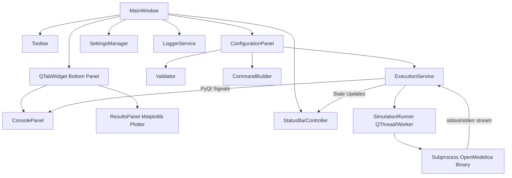

# OpenModelica Simulation Manager

I built this as a desktop app for running OpenModelica simulation executables without touching the command line with the help of ai tools. If you've ever had to babysit a `.exe` through a terminal, tweak start/stop times by hand, and then eyeball a CSV to see if the run actually worked — this is the tool I wished existed, so I made it. Python 3.11+, PyQt6 for the UI, Matplotlib for the plots.

[](https://www.python.org/)
[](https://pypi.org/project/PyQt6/)
[](https://matplotlib.org/)

---

## What it does

I wanted the CLI execution experience wrapped in something that felt like an actual IDE — closer to Qt Creator or VS Code than a bare script runner. So there's a real GUI: you pick an executable, set your time bounds, hit run, and watch the console stream live while a plot builds itself on the other tab.

## How I put it together

I split things along fairly strict MVC lines, mostly because I got tired of debugging spaghetti in earlier versions of this project. UI, business logic, and data models live in separate layers, and the execution itself runs on a background thread so the app never locks up mid-simulation.



The pieces, roughly:

- **`MainWindow`** — the root window. Handles the split layout, dark/light theme switching, keyboard shortcuts, dialogs.
- **`ConfigurationPanel`** — where you point at an executable (drag-and-drop works too), pick times, and see a live preview of the command that's about to run.
- **`ConsolePanel`** — a dark, monospace log that streams stdout and stderr as they happen, with auto-scroll, clear, copy, and export.
- **`ResultsPanel`** — the Matplotlib tab. Plots your solver variables over time and lets you export as PNG or CSV.
- **`ExecutionService` / `SimulationRunner`** — runs the subprocess on a `QThread`, with two separate reader threads for stdout and stderr so neither pipe blocks the other.
- **`Validator`** — enforces `0 <= start_time < stop_time < 5` and checks the executable is actually valid before letting you run anything.
- **`CommandBuilder`** — builds the `-override=startTime=X,stopTime=Y` arguments OpenModelica expects.
- **`SettingsManager`** — remembers your window size, theme, recent files, and run history between sessions, using `QSettings`.

## What's actually in it

I kept adding things as I hit friction points, so here's what ended up in the final build:

- An executable picker with drag-and-drop, a recent-files dropdown, and status badges so you know at a glance whether what you picked is valid.
- Spinbox inputs for start and stop time, validated instantly — the Run button just disables itself if your numbers don't make sense.
- A live command preview with a one-click copy, plus a tooltip showing the full absolute path if you hover.
- Concurrent stdout/stderr streaming on separate threads, so long runs don't freeze the UI, and you can cancel mid-run with Esc or the Stop button.
- An interactive plot tab that parses solver output automatically — for the bundled tank model, that's Tank 1 and Tank 2 height over time.
- Export to PNG for plots, CSV for the raw time-series data.
- Dark and light themes, both styled after the Qt Creator look, toggleable from the toolbar.
- Run history and logs that persist across sessions — every run gets logged with executable, timestamp, duration, and exit code.

## Project layout

```text
OpenModelica Simulation Manager/
├── src/
│   ├── main.py                    # entry point
│   ├── ui/                        # PyQt6 UI layer
│   │   ├── main_window.py
│   │   ├── toolbar.py
│   │   ├── configuration_panel.py
│   │   ├── console_panel.py
│   │   ├── results_panel.py
│   │   ├── status_bar.py
│   │   └── widgets.py
│   ├── core/                      # business logic
│   │   ├── simulation_runner.py
│   │   ├── validator.py
│   │   ├── settings_manager.py
│   │   ├── command_builder.py
│   │   └── logger.py
│   ├── models/                    # data models
│   │   ├── simulation_config.py
│   │   └── simulation_result.py
│   ├── services/
│   │   ├── execution_service.py
│   │   └── storage_service.py
│   └── utils/
│       ├── constants.py
│       ├── helpers.py
│       └── exceptions.py
├── resources/
│   ├── icons/
│   └── styles/
│       ├── dark_theme.qss
│       └── light_theme.qss
├── mock_executable/                # a standalone mock exe so you can test without OpenModelica installed
│   ├── TwoConnectedTanks.exe
│   ├── TwoConnectedTanks.py
│   └── TwoConnectedTanks.bat
├── tests/
│   ├── test_validator.py
│   ├── test_command_builder.py
│   ├── test_concurrent_streaming.py
│   ├── test_results_panel.py
│   ├── test_simulation_config.py
│   ├── test_settings_manager.py
│   └── test_execution_integration.py
├── build_app.py                    # one-click packaging into a standalone .exe
├── README.md
├── requirements.txt
└── LICENSE
```

## Getting it running

You'll need Python 3.11+, PyQt6 6.5+, and Matplotlib 3.8+. Works on Windows 10/11 or Linux.

```bash
git clone https://github.com/JojoAArtI/OpenModelica-Simulation-Manager.git
cd "OpenModelica Simulation Manager"
pip install -r requirements.txt
```

Then just:

```bash
python src/main.py
```

## Trying it out with the mock executable

I bundled a fake `TwoConnectedTanks.exe` so you can poke around without needing an actual OpenModelica install:

1. Drag `mock_executable/TwoConnectedTanks.exe` into the executable field (or click Browse).
2. You should see a green "Executable Loaded" badge.
3. Set Start Time to `0`, Stop Time to `4`.
4. Hit Run Simulation.
5. Watch the log scroll in the Execution Console tab.
6. Flip over to Results & Analysis to see the fluid level curves plot themselves.
7. Export as PNG or CSV if you want to keep the data.

## Packaging it as a standalone app

```bash
python build_app.py
```

This spits out `dist/OpenModelicaSimulationManager.exe` — a self-contained build you can hand to someone without them needing Python installed at all.

## Running the tests

There are 19 tests covering validation, command building, concurrent streaming, and the rest:

```bash
python -m pytest tests/ -v
```

## Validation rules, for reference

| Parameter | Type | Rule |
| :--- | :--- | :--- |
| Executable | File path | Must exist, be a file, and be one of `.exe`, `.bat`, `.cmd`, `.py`. |
| Start Time | Integer (spinbox) | `0 <= start_time <= 4` |
| Stop Time | Integer (spinbox) | `1 <= stop_time <= 4` |
| Combined | — | `0 <= start_time < stop_time < 5` |

## License

MIT. See [LICENSE](LICENSE).
