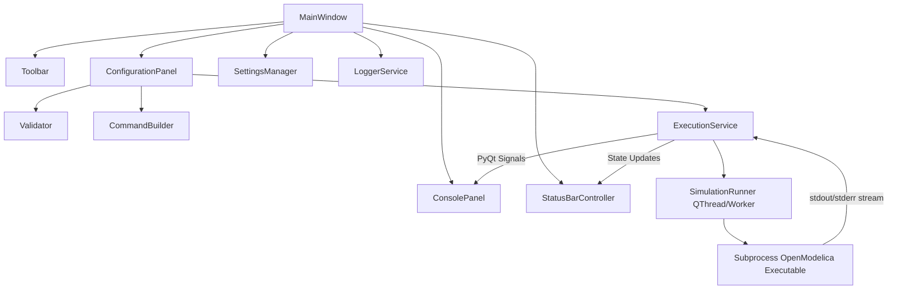

# OpenModelica Simulation Manager

> A professional desktop engineering application and graphical launcher for OpenModelica simulation executables built with Python 3.11+ and PyQt6.

[](https://www.python.org/)
[](https://pypi.org/project/PyQt6/)
[](LICENSE)
[]()

---

## 📌 Project Overview

**OpenModelica Simulation Manager** is a desktop software application designed for engineers, researchers, and developers working with [OpenModelica](https://openmodelica.org/) model executables (such as `TwoConnectedTanks.exe`). 

It wraps the command-line execution experience into a modern, responsive GUI inspired by professional IDEs and engineering platforms like **Qt Creator**, **VS Code**, and **ANSYS**.

---

## 🏗️ Architecture & Component Design

The application follows strict **SOLID principles**, **Separation of Concerns**, and **Model-View-Controller / Model-View-ViewModel (MVC/MVVM)** architectural patterns.



### Key Components

- **`MainWindow`**: Root window managing vertical split layout, dark/light themes, keyboard shortcuts, and modal dialogs.
- **`ConfigurationPanel`**: Inputs for executable path, drag-and-drop support, recent files dropdown, start/stop spinboxes, real-time validation feedback, live command preview, and primary Run button.
- **`ConsolePanel`**: Read-only dark monospace log stream supporting live stdout/stderr colored output, auto-scroll, clear log, copy, and log export.
- **`ExecutionService` & `SimulationRunner`**: Executes binary subprocesses in a non-blocking background `QThread` using `subprocess.Popen` with line-by-line unbuffered streaming.
- **`Validator`**: Enforces runtime validation rules (`0 <= start_time < stop_time < 5`) and executable file checks.
- **`CommandBuilder`**: Constructs OpenModelica `-override=startTime=X,stopTime=Y` arguments.
- **`SettingsManager`**: Persists window geometry, themes, recent executables list, and execution history via `QSettings`.

---

## 🚀 Features

- 📁 **Executable Selector**: Read-only textbox with native file browser, drag-and-drop file support, recent files history dropdown, and status badges (`✔ Executable Loaded` / `❌ Invalid executable`).
- ⏱️ **SpinBox Time Inputs**: Integer inputs for Start Time (0..4) and Stop Time (1..4).
- ⚡ **Realtime Validation**: Instant validation enforcing `0 <= start_time < stop_time < 5`. Automatically disables the Run button when parameters are invalid.
- 💻 **Live Command Preview**: Real-time CLI command string display with one-click copy button.
- 🔄 **Non-Blocking Asynchronous Execution**: Prevents GUI freezing during solver execution; supports process cancellation via `ESC` or Stop button.
- 📊 **Live Console Streaming**: Dark monospace text log view streaming `stdout` and `stderr` live with distinct color coding.
- 🌗 **Dark & Light Engineering Themes**: Qt Creator styled themes easily toggled via the main toolbar.
- 📜 **Execution History & Log Persistence**: Persists run history (executable, timestamp, duration, exit code) using `QSettings` and writes multi-handler logs (`logs/app.log`, `logs/execution.log`).

---

## 🛠️ Directory Structure

```text
OpenModelica Simulation Manager/
├── src/
│   ├── main.py                    # Application entry point
│   ├── ui/                        # PyQt6 UI Presentation Layer
│   │   ├── main_window.py          # Main Window & Splitter
│   │   ├── toolbar.py              # Application Top Toolbar
│   │   ├── configuration_panel.py  # Simulation Configuration Card
│   │   ├── console_panel.py        # Dark Monospace Execution Console
│   │   ├── status_bar.py           # Status Bar Controller & Timer
│   │   └── widgets.py              # Custom Reusable Widgets & Cards
│   ├── core/                      # Core Business Logic Layer
│   │   ├── simulation_runner.py    # QThread Subprocess Worker
│   │   ├── validator.py            # Input Validation Engine
│   │   ├── settings_manager.py     # QSettings Persistence Manager
│   │   ├── command_builder.py      # OpenModelica CLI Command Generator
│   │   └── logger.py               # Multi-handler Logging Service
│   ├── models/                    # Domain Data Models
│   │   ├── simulation_config.py    # Simulation Configuration Model
│   │   └── simulation_result.py    # Execution Result Model
│   ├── services/                  # Application Services Layer
│   │   ├── execution_service.py    # Async Execution Service
│   │   └── storage_service.py      # Execution History Storage Service
│   └── utils/                     # Utility Functions & Constants
│       ├── constants.py            # App Constants & Boundaries
│       ├── helpers.py              # Path & Duration Helpers
│       └── exceptions.py           # Custom Domain Exceptions
├── resources/                     # Visual Assets & QSS Stylesheets
│   └── styles/
│       ├── dark_theme.qss          # Modern Qt Creator Dark Theme
│       └── light_theme.qss         # Modern Engineering Light Theme
├── mock_executable/               # Sample Executable for Testing
│   ├── TwoConnectedTanks.py        # Python solver mock executable
│   └── TwoConnectedTanks.bat       # Windows Batch Wrapper
├── tests/                         # Pytest Automated Test Suite
│   ├── test_validator.py
│   ├── test_command_builder.py
│   ├── test_simulation_config.py
│   ├── test_settings_manager.py
│   └── test_execution_integration.py
├── README.md                      # Project Documentation
├── requirements.txt               # Dependencies
└── LICENSE                        # MIT License
```

---

## 📦 Installation & Setup

### Requirements

- **Python**: Version 3.11 or higher
- **PyQt6**: `6.5.0+`
- **OS**: Windows 10/11 or Linux

### Installation

1. **Clone the repository**:
   ```bash
   git clone https://github.com/your-username/OpenModelica-Simulation-Manager.git
   cd "OpenModelica Simulation Manager"
   ```

2. **Create a virtual environment (optional but recommended)**:
   ```bash
   python -m venv venv
   # Windows:
   venv\Scripts\activate
   # Linux/macOS:
   source venv/bin/activate
   ```

3. **Install dependencies**:
   ```bash
   pip install -r requirements.txt
   ```

---

## 🏃 Running the Application

Launch the desktop application using:

```bash
python src/main.py
```

### Testing with the bundled mock executable

To test the application immediately without compiling an OpenModelica model:

1. Click **Browse...** or drag and drop `mock_executable/TwoConnectedTanks.py` (or `TwoConnectedTanks.bat`) into the executable field.
2. Confirm that the validation status badge displays **`✔ Executable Loaded`**.
3. Set **Start Time** to `0` and **Stop Time** to `4`.
4. Observe the **Command Preview**:
   ```text
   TwoConnectedTanks.py -override=startTime=0,stopTime=4
   ```
5. Click **▶ Run Simulation**.
6. Watch real-time log output stream in the **Execution Console**.

---

## 🧪 Running Unit Tests

The codebase includes comprehensive automated unit and integration tests written with `pytest`.

Run all tests with:

```bash
python -m pytest tests/ -v
```

---

## 📋 Validation Rules

Per the screening assignment criteria:

| Parameter | Type | Validation Rule |
| :--- | :--- | :--- |
| **Executable** | File Path | Must exist, be a file, and be executable (`.exe`, `.bat`, `.cmd`, `.py`). |
| **Start Time** | Integer (`QSpinBox`) | `0 <= start_time <= 4` |
| **Stop Time** | Integer (`QSpinBox`) | `1 <= stop_time <= 4` |
| **Combined** | Condition | `0 <= start_time < stop_time < 5` |

---

## 🔮 Future Improvements

- 📈 **Result Visualization**: Plot simulation output matrix (`.mat` / `.csv` files) using PyQtGraph or Matplotlib.
- 🎛️ **Parameter Override Matrix**: Extend `-override` flags to support initial state variables and parameter sweeps.
- 📦 **Executable Compiler Integration**: Direct integration with `omc` (OpenModelica Compiler) to compile `.mo` files inside the app.

---

## 📄 License

This project is licensed under the [MIT License](LICENSE).
