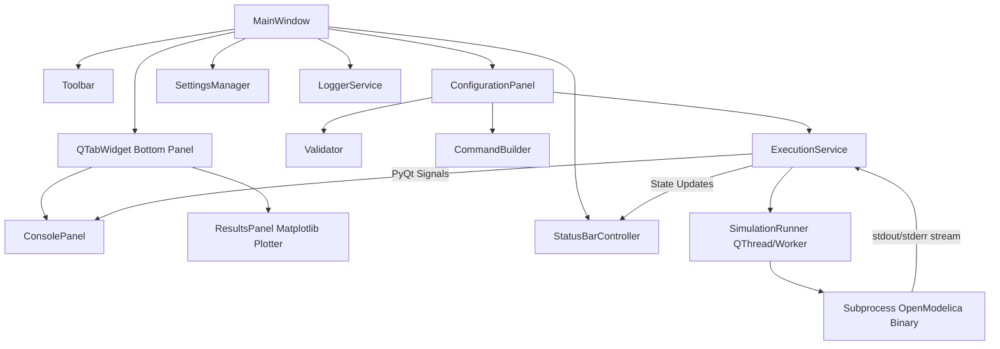

# OpenModelica Simulation Manager

> A professional desktop engineering application, graphical launcher, and interactive visualization suite for OpenModelica simulation executables built with Python 3.11+ and PyQt6.

[](https://www.python.org/)
[](https://pypi.org/project/PyQt6/)
[](https://matplotlib.org/)
[]()

---

##  Project Overview

**OpenModelica Simulation Manager** is a desktop engineering application designed for engineers, researchers, and developers working with [OpenModelica](https://openmodelica.org/) model executables (such as `TwoConnectedTanks.exe`). 

It wraps the command-line execution experience into a modern, responsive GUI inspired by professional IDEs and engineering platforms like **Qt Creator**, **VS Code**, and **ANSYS**.

---

##  Architecture & Component Design

The application follows strict **SOLID principles**, **Separation of Concerns**, and **Model-View-Controller / Model-View-ViewModel (MVC/MVVM)** architectural patterns.



### Key Components

- **`MainWindow`**: Root window managing vertical split layout, dark/light themes, keyboard shortcuts, and modal dialogs.
- **`ConfigurationPanel`**: Inputs for executable path, drag-and-drop support, recent files dropdown, start/stop spinboxes, real-time validation feedback, live command preview, and primary Run button.
- **`ConsolePanel`**: Read-only dark monospace log stream supporting live concurrent stdout/stderr colored output, auto-scroll, clear log, copy, and log export.
- **`ResultsPanel`**: Interactive Matplotlib time-series chart tab plotting solver variables over time with controls to export PNG images or CSV spreadsheets.
- **`ExecutionService` & `SimulationRunner`**: Executes binary subprocesses in a non-blocking background `QThread` using dual concurrent reader threads (`t_stdout` and `t_stderr`).
- **`Validator`**: Enforces runtime validation rules (`0 <= start_time < stop_time < 5`) and executable file checks.
- **`CommandBuilder`**: Constructs OpenModelica `-override=startTime=X,stopTime=Y` arguments.
- **`SettingsManager`**: Persists window geometry, themes, recent executables list, and execution history via `QSettings`.

---

##  Key Features

-  **Executable Selector**: Read-only textbox with native file browser, drag-and-drop file support, recent files history dropdown, and status badges (`✔ Executable Loaded`, `❌ Invalid executable`, `ℹ No executable selected`).
-  **SpinBox Time Inputs**: Integer inputs for Start Time (0..4) and Stop Time (1..4).
-  **Realtime Validation**: Instant validation enforcing `0 <= start_time < stop_time < 5`. Automatically disables the Run button when parameters are invalid.
-  **Live Command Preview**: Real-time CLI command display (relative name preview + absolute path hover tooltip) with a one-click copy button.
-  **Concurrent Pipe Execution**: Non-blocking dual-thread stdout/stderr streaming prevents pipe deadlocks and GUI freezing; supports process cancellation via `ESC` or Stop button.
-  **Interactive Plotter Tab**: Embedded Matplotlib visualization tab automatically parsing solver output curves (e.g. `Tank 1 Height` & `Tank 2 Height` vs `Time`).
-  **PNG & CSV Exporters**: Export plots to high-res PNG images or export parsed time-series data to CSV spreadsheets.
-  **Dark & Light Engineering Themes**: Qt Creator styled themes easily toggled via the main toolbar.
-  **Execution History & Log Persistence**: Persists run history (executable, timestamp, duration, exit code) using `QSettings` and writes multi-handler logs (`logs/app.log`, `logs/execution.log`).

---

## 🛠️ Directory Structure

```text
OpenModelica Simulation Manager/
├── src/
│   ├── main.py                    # Application entry point
│   ├── ui/                        # PyQt6 UI Presentation Layer
│   │   ├── main_window.py          # Main Window & Splitter
│   │   ├── toolbar.py              # Application Top Toolbar
│   │   ├── configuration_panel.py  # Simulation Configuration Card
│   │   ├── console_panel.py        # Dark Monospace Execution Console
│   │   ├── results_panel.py        # Matplotlib Interactive Results Plotter
│   │   ├── status_bar.py           # Status Bar Controller & Timer
│   │   └── widgets.py              # Custom Reusable Widgets & Cards
│   ├── core/                      # Core Business Logic Layer
│   │   ├── simulation_runner.py    # QThread Subprocess Worker with Concurrent Streaming
│   │   ├── validator.py            # Input Validation Engine
│   │   ├── settings_manager.py     # QSettings Persistence Manager
│   │   ├── command_builder.py      # OpenModelica CLI Command Generator
│   │   └── logger.py               # Multi-handler Logging Service
│   ├── models/                    # Domain Data Models
│   │   ├── simulation_config.py    # Simulation Configuration Model
│   │   └── simulation_result.py    # Execution Result Model
│   ├── services/                  # Application Services Layer
│   │   ├── execution_service.py    # Async Execution Service
│   │   └── storage_service.py      # Execution History Storage Service
│   └── utils/                     # Utility Functions & Constants
│       ├── constants.py            # App Constants & Boundaries
│       ├── helpers.py              # Path & Duration Helpers
│       └── exceptions.py           # Custom Domain Exceptions
├── resources/                     # Visual Assets & QSS Stylesheets
│   ├── icons/                     # Vector SVG Icons
│   └── styles/
│       ├── dark_theme.qss          # Modern Qt Creator Dark Theme
│       └── light_theme.qss         # Modern Engineering Light Theme
├── mock_executable/               # Standalone Mock Executable for Testing
│   ├── TwoConnectedTanks.exe       # Standalone Windows native binary
│   ├── TwoConnectedTanks.py        # Python solver mock source
│   └── TwoConnectedTanks.bat       # Windows Batch Wrapper
├── tests/                         # Pytest Automated Test Suite
│   ├── test_validator.py
│   ├── test_command_builder.py
│   ├── test_concurrent_streaming.py
│   ├── test_results_panel.py
│   ├── test_simulation_config.py
│   ├── test_settings_manager.py
│   └── test_execution_integration.py
├── build_app.py                   # One-click PyInstaller packaging script
├── README.md                      # Project Documentation
├── requirements.txt               # Dependencies
└── LICENSE                        # MIT License
```

---

##  Installation & Setup

### Requirements

- **Python**: Version 3.11 or higher
- **PyQt6**: `6.5.0+`
- **Matplotlib**: `3.8.0+`
- **OS**: Windows 10/11 or Linux

### Installation

1. **Clone the repository**:
   ```bash
   git clone https://github.com/JojoAArtI/OpenModelica-Simulation-Manager.git
   cd "OpenModelica Simulation Manager"
   ```

2. **Install dependencies**:
   ```bash
   pip install -r requirements.txt
   ```

---

##  Running the Application

Launch the desktop application using:

```bash
python src/main.py
```

### Testing with the bundled standalone `.exe`

1. Click **Browse...** or drag and drop `mock_executable/TwoConnectedTanks.exe` into the executable field.
2. Observe the badge **`✔ Executable Loaded`**.
3. Set **Start Time** to `0` and **Stop Time** to `4`.
4. Click **Run Simulation**.
5. Watch real-time logs in the **Execution Console** tab.
6. Switch to the **Results & Analysis Plot** tab to inspect the interactive fluid level curves.
7. Click **Export Plot (PNG)** or **Export Data (CSV)** to save results.

---

##  One-Click App Packaging (`build_app.py`)

Package the entire application into a standalone executable (`dist/OpenModelicaSimulationManager.exe`):

```bash
python build_app.py
```

---

##  Running Unit Tests

Run all 19 automated tests with:

```bash
python -m pytest tests/ -v
```

---

## 📋 Validation Rules

| Parameter | Type | Validation Rule |
| :--- | :--- | :--- |
| **Executable** | File Path | Must exist, be a file, and be executable (`.exe`, `.bat`, `.cmd`, `.py`). |
| **Start Time** | Integer (`QSpinBox`) | `0 <= start_time <= 4` |
| **Stop Time** | Integer (`QSpinBox`) | `1 <= stop_time <= 4` |
| **Combined** | Condition | `0 <= start_time < stop_time < 5` |

---

## 📄 License

This project is licensed under the [MIT License](LICENSE).
